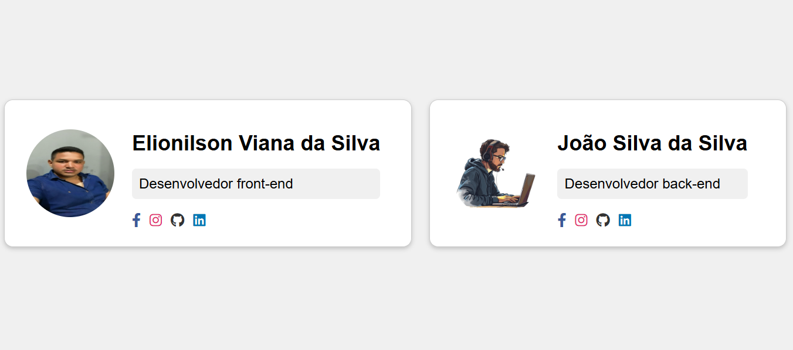

# 🌐 Projeto cards

Este projeto é uma **landing page** para um a exibição de cards de apresentação de dois desenvolvedores Elionilson viana da silva e João silva da silva.  
O objetivo é praticar **HTML** e **CSS**, aplicando conceitos de layout, icons, display flex e estilização moderna.

---

## 📑 Funcionalidades

- **Iamgem do desenvolvedores** com borda e raidos.
- **Icones funcionais do contatos** com links principais.  
- **descrição da profissao**.

---

## 🛠️ Tecnologias Utilizadas

- **HTML5** → Estrutura da página.  
- **CSS3** → Estilização, responsividade e design moderno.  
- **Font Awesome** → Ícones visuais.  

---

## 📂 Estrutura de Pastas

├── Projeto-Cards
  ├── css/
    └──styless.css     # estilização da pagina principal
  ├── html/
     └── index.html    #pagina principal     
  ├── img/                # Imagens do projeto (fotos dos desenvolvedores)

🚀 Como Executar:
1 ° : git clone https://github.com/kafu14/Projeto-Cards.git # baixe a pasta do projeto do githuh no seu computador.
2°  : abra a pasta do projeto "Projeto-Cards.
3° : Abra o arquivo index.html localizado na pasta HTML;

Prévia do Projeto

📌 Autor

👤 Desenvolvido por Elionilson V. da silva
📧 Email: Elionilson.cafu14@gmail.com

🔗 LinkedIn: www.linkedin.com/in/elionilson-viana-075206326

## Licença

Projeto criado para fins educacionais e de aprendizado. Livre para uso pessoal e acadêmico.